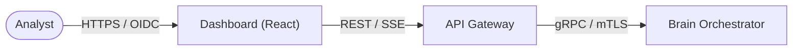

# Aegis AI — Analyst Dashboard

**Project ID:** AEGIS-CORE-2026

The Aegis AI Dashboard is the primary command and control interface for security analysts. A high-performance React 18 application that provides real-time visualization of orchestrated pentests, vulnerability intelligence, and automated remediation workflows.

---

## 🏗️ Role in the Ecosystem

The Dashboard handles all user-facing interactions and visualizes the massive data output from the Brain cluster.

- **Live Attack Map**: Real-time visualization of scan progress via **Server-Sent Events (SSE)**.
- **Vulnerability Vault**: Deep-dive into discovered CVEs with technical evidence and loot.
- **Remediation Hub**: Automated patch generation and GitOps-driven deployment triggers.



---

## 🛠️ Tech Stack

| Component        | Technology                   | Version |
| ---------------- | ---------------------------- | ------- |
| Core Framework   | **React 18**                 | 18.2+   |
| Build Tool       | **Vite**                     | 5.x     |
| State Management | **Zustand**                  | 4.x     |
| Data Fetching    | **React Query** (TanStack)   | 5.x     |
| Real-time        | **SSE** (Server-Sent Events) | —       |

---

## 🔐 Security & Access Control

- **OIDC / PKCE**: Mandatory OpenID Connect authentication with Proof Key for Code Exchange (PKCE).
- **Zero Local Tokens**: Access tokens are kept exclusively in memory; refresh tokens are stored in secure, HTTP-only cookies.
- **CSRF Protection**: Comprehensive protection across all state-changing endpoints.
- **Environment Isolation**: Build-time secret injection only for the public API entry points.

---

## 🐳 Deployment (Docker)

The Dashboard is served as a static build optimized for high-performance delivery.

```bash
docker pull ghcr.io/aegis-ai/aegis-dashboard:latest

# Run the static build server
docker run -d \
  --name aegis-dashboard \
  --read-only \
  -p 80:80 \
  -e API_BASE_URL="https://api.aegis.ai/v2" \
  ghcr.io/aegis-ai/aegis-dashboard:latest
```

---

## 🛠️ Development

```bash
# Install dependencies
npm install

# Run dev server
npm run dev

# Run unit tests
npm test
```

---

_Aegis AI — User Experience & Visualization — 2026_
